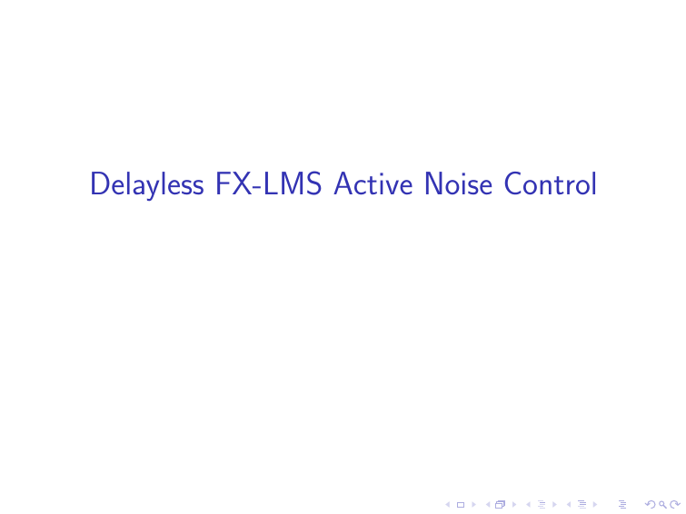
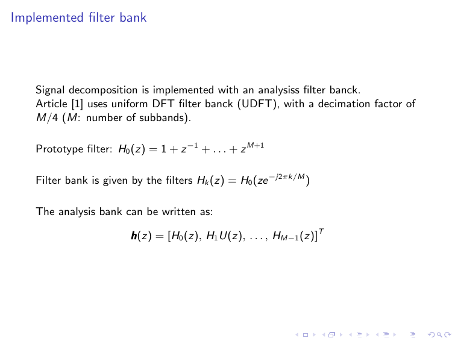
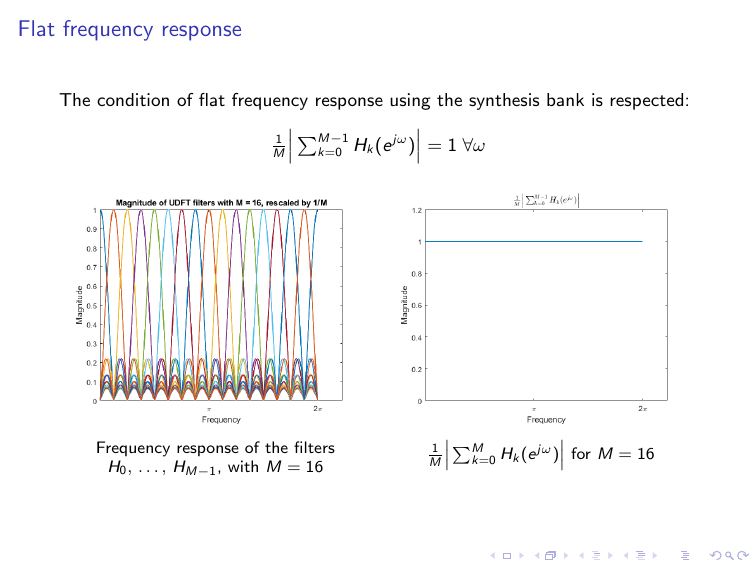
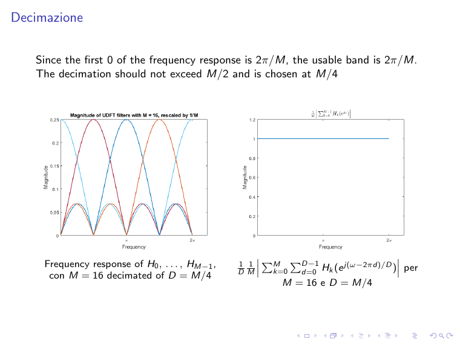
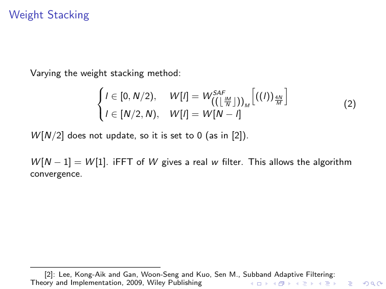
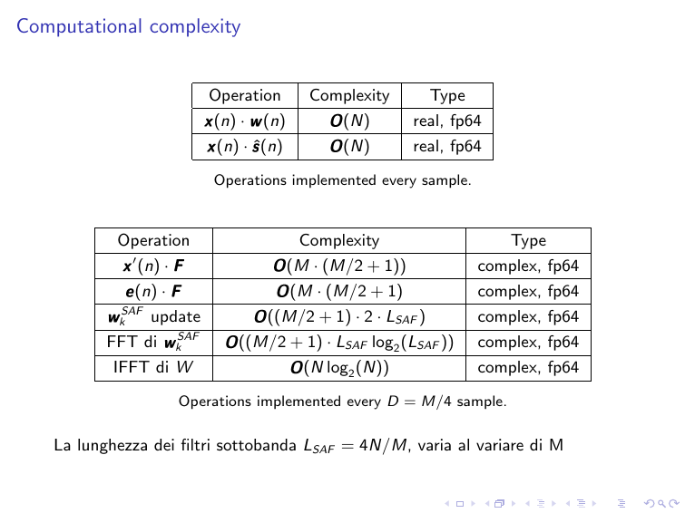
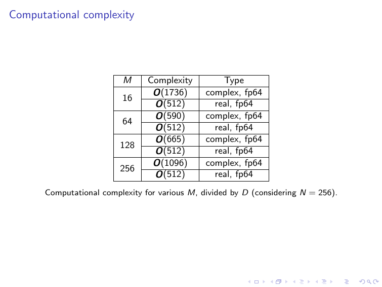

# Active noise control
## Overview
The project is about an Active Noise Control algorithm implementation, using Matla. The addressed algorithms is the Delayless Filtered-x Least Mean Squares (FxLMS) technique.

## Detailed explaination

